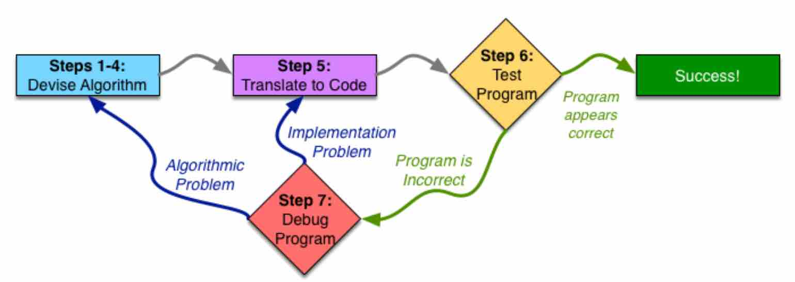
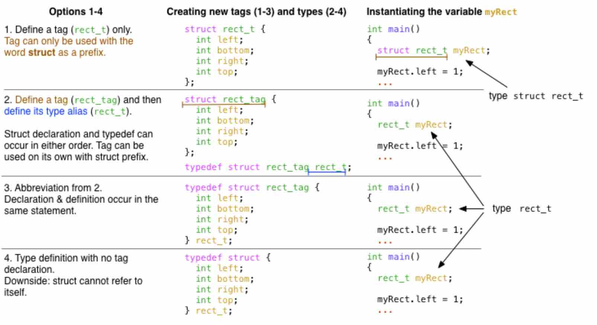
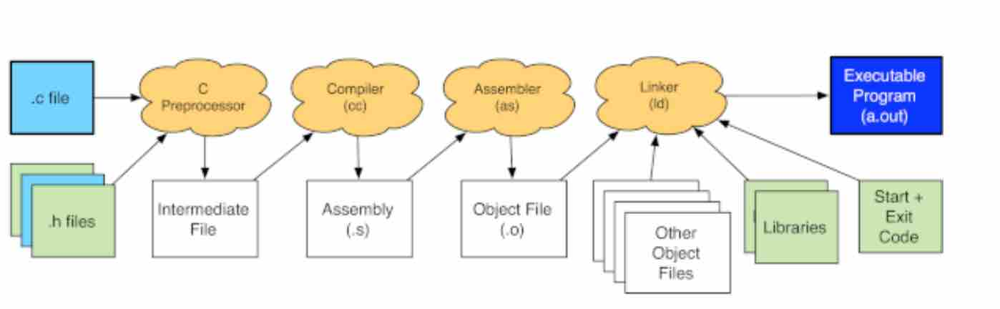

## Overview of the seven steps




## Complex, custom data types

### struct



```c
// option 1
struct rect_tag {
  int left;
  int bottom;
  int right;
  int top;
};

typedef struct rect_tag rect_t;

// option 2
typedef struct rect_tag {
  int left;
  int bottom;
  int right;
  int top;
} rec_t;
```


compilation process



上图显示了gcc编译代码的过程的高层次概述。在这幅图中，浅蓝色方框代表你写的代码，浅绿色方框代表C语言的内置部分。橙色云朵表示这个过程的步骤（每个步骤都是一个独立的程序，但gcc为你调用这些程序），白色方框代表gcc生成的中间文件，用于将信息从一个阶段传递到下一个阶段。右上方的深蓝色方框代表最终的可执行文件--你可以运行的程序，使你的计算机做任何程序所要做的事。


The return value from main indicates the success or failure of your program to whatever program ran it.


```sh
$ gcc -o hello -Wall -Werror -pedantic -std=gnu99 hello.c
```


how to use man page


```sh
$ man -k keyword
```


```sh
$ diff -y 1.txt 2.txt


```


