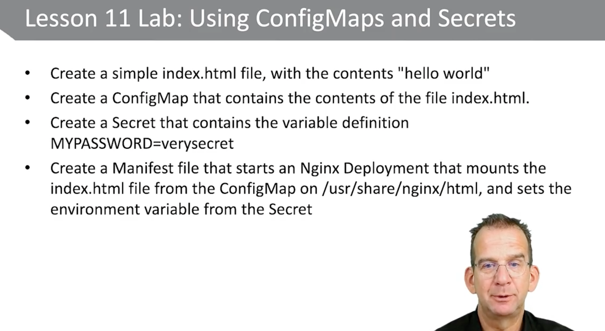

```sh
setenforce 0
mkdir-p/var/www/html
echo hello from docker >> /var/www/html/index.html
docker run -d -p 8080:80 --name="myapache" -v /var/www/html:/var/www/html httpd
docker ps
ss -tunap I grep 8080
curl http://localhost:8080

docker run -it busybox
# Ctrl-p, Ctrl-q to disconnect and keep it running

docker ps

docker ps -a 
# start and stopped

docker start

docker stop

docker restart

docker kill

docker rm

```

config vim for yaml

```
autocmd FileType yaml setlocal ai ts=2 sw=2 et
```


### Inspecting Container Settings

```sh
docker ps # will show the IDs of containers: pick one!
docker inspect <ID> | less
docker inspect --format='{{.NetworkSettings.IPAddress}}' myapache
docker inspect --format='{{.State.Pid}}' myapache

```


```sh
docker build -t nmap .

docker build --no-cache -t nmap .
```

### Container Logging


- https://kubernetes.io/docs/reference/kubectl/cheatsheet/
- https://kubernetes.io/docs/reference/generated/kubectl/kubectl-commands


```sh
kubectl run --help

```

## Lesson 3: Creating a Lab Environment

```sh
free -m
df -h

grep vmx /proc/cpuinfo

# no vmx output
dnf groupinfo virtualization
sudo dnf install @virtualization
```


install on macOS

```sh
curl -LO "https://dl.k8s.io/release/v1.24.0/bin/darwin/amd64/kubectl"
```


```sh
minikube start

minikube start --memory=8192 --cpus=4 --disk-size=20g  --registry-mirror=https://docker.mirrors.ustc.edu.cn --kubernetes-version=v1.12.5 --docker-env http_proxy=http://192.168.0.40:8123 --docker-env https_proxy=http://192.168.0.40:8123 --docker-env no_proxy=localhost,127.0.0.1,::1,192.168.0.0/24,192.168.99.0/24


minikube start --memory=8192 --cpus=4 --disk-size=20g --kubernetes-version=v1.12.5 

minikube start --memory=8192 --cpus=4 --disk-size=20g  --registry-mirror=https://docker.mirrors.ustc.edu.cn --kubernetes-version=v1.12.5 --docker-env http_proxy=http://192.168.0.40:8123 --docker-env https_proxy=http://192.168.0.40:8123 --docker-env no_proxy=localhost,127.0.0.1,::1,192.168.0.0/24,192.168.99.0/24

# this works
minikube start --memory=4096 --cpus=4 --disk-size=20g --image-mirror-country=cn --image-repository='registry.cn-hangzhou.aliyuncs.com/google_containers'

minikube start --memory=4096 --cpus=4 --disk-size=20g --image-mirror-country=cn --registry-mirror=https://docker.mirrors.ustc.edu.cn --driver=docker

minikube start --memory=4096 --cpus=4 --disk-size=20g --driver=docker --docker-env HTTP_PROXY=$http_proxy --docker-env HTTPS_PROXY=$https_proxy --image-mirror-country=cn
```


```sh
kubectl cluster-info
kubectl get nodes

minikube --help

kubectl run nginx-run --image=nginx
kubectl get all
```


## Lesson 4: Understanding API and Management Options

The context that kubectl uses is stored in `~/.kube/config`
This context defines which cluster to connect to
Use `kubectl config view` to view different parts of the current
configuration, including current context and namespace


```
curl http://localhost:8001/api/v1/namespaces/default/pods

to find out what's going on
kubectl api-resources | less

/deploy # search in less

kubectl api-versions | less
```


## Lesson 5


* A Pod is an abstraction of a server
  * It can run multiple containers within a single NameSpace, exposed by a single IP address


```sh
kubectl get pods -o yaml

kubectl edit pods busybox # not the way

kubectl create -f busybox.yaml

kubectl explain pods.spec

kubectl get deployments nginx-run -o yaml > nginx-declarative.yaml
# delete status (operational info)

k create --help
k apply --help
k replace --help # replace is good for changing objects

k create -f sleepy.yaml
k get pods -o wide
k describe pods sleepy
k logs sleepy

k create -f sidecar.yaml
k exec -it sidecar-pod -c sidecar /bin/bash

```

Typically, one container is offered through a Pod

Single Container pods are easier to build and maintain

cases where you want to run multiple containers in a Pod

​	Sidecar container: a container that enhances the primary application, for instance for logging

​	Ambassador container: a container that represents the primary container to the outside world, such as a proxy
​	Adapter container: used to adopt the traffic or data pattern to match the traffic or data pattern in other applications in the cluster


### using namespace

```sh
k get all --all-namespaces
k get namespaces
# 需要先创建namespace
k create namespace sercet
```


https://kubernetes.io/docs/tasks/administer-cluster/namespaces/


```yaml
apiVersion: v1
kind: Namespace
metadata:
	name: production
```


```sh
k create ns production --dry-run=client -o yaml > lab5-ns.yaml
k create -f lab5-ns.yaml

k get pods -n production

--dry-run=false: If true, only print the object that would be sent, without sending it
```


## Lesson 6: Managing Pod Advanced Features

### 6.1 Inspecting Pods

* `kubectl describe` is very genetic and more focused on the Kubernetes database, 
* `kbectl logs` will show you a command output and that is useful to analyze if the default commands in the container is running successfully. 
* And `kubectl exec` allows you to deeply explore what is going on. 


### 6.2 Monitoring Pods


```sh
$ kubectl get pods -A
# equal
$ kubectl get pods --all-namespaces

$ kubectl get pods -n secret

```

### 6.3 Using Port forwarding to access pods

```sh
$ k apply -f nginx.yaml
$ k port-forward pod/nginx 8080:80

# 8080 is the port in the localhost
# 80 is the port in the pod
```


6.4 SecurityContext


### 6.5 Managing Jobs

* Pods normally are created to run forever
* To create a Pod that runs for a limited duration, use Jobs instead
* Jobs are useful for tasks, like backup, calculation, batch processing and more A Pod that is started by a Job must have its **restartPolicy** set to **OnFailure** or **Never**
  * **OnFailure** will re-run the container on the same Pod
  * **Never** will re-run the failing container in a new Pod
* 3 different Job types can be started, which is specified by the completions and parallelism parameters:
  * Non-parallel Jobs: one Pod is started, unless the Pod fails
    **completions=1**
    **parallelism=1**
  * Parallel Jobs with a fixed completion count: the Job is complete after successfully running as many times as specified in jobs.spec.completions
    **completions=n**
    **parallelism=m**
  * Parallel Jobs with a work queue: multiple Jobs are started, when one completes successfully, the Job is complete
    **completions=1**
    **parallelism=n**


```yaml
apiVersion: batch/v1
kind: Job
metadata:
  name: simple-job
spec:
  completions: 3
  template:
    spec:
      containers:
      - name: sleepy
        image: alpine
        command: [ "/bin/sleep" ]
        args: [ "5" ]
      restartPolicy: Never
```


### 6.6 Cron Jobs

```sh
$ kubectl explain cronjob.spec
```

```yaml
apiVersion: batch/v1beta1
kind: CronJob
metadata:
  name: hello-cronjob
spec:
  schedule: "*/2 * * * *"
  jobTemplate:
    spec:
      template:
        spec:
          containers:
          - name: hello
            image: busybox
            args:
            - /bin/sh
            - -c
            - date; echo hello from the K8s cluster
          restartPolicy: OnFailure

```


```sh
k create -f cron-example.yaml
k get cronjobs.batch
k get cronjobs.batch -o yaml | less

k get jobs --watch
k get pods hello-cronjob -o yaml

$ kubectl delete cronjobs.batch hello-cronjob
```


### 6.7 Managing Resources limitations and Quota

By default, a Pod will use as much CPU and memory as necessary to do its work
This can be managed by using Memory/CPU requests and limits in
pod.spec.containers.resources
A request is an initial request for resources
A limit defines the upper threshold of resources a Pod can use

* CPU limits are expressed in millicore or millicpu, 1/1000 of a CPU core
  * So, 500 millicore is 0.5 CPU
* When being scheduled, the kube-shceduler ensures that the node running the Pods has all requested resources available
* If a Pod with resource limits cannot be scheduled, it will show a status of Pending


```yaml
apiVersion: v1
kind: Pod
metadata:
  name: frontend
spec:
  containers:
  - name: db
    image: mysql
    env:
    - name: MYSQL_ROOT_PASSWORD
      value: "password"
    resources:
      requests:
        memory: "64Mi"
        cpu: "250m"
      limits:
        memory: "128Mi"
        cpu: "500m"
  - name: wp
    image: wordpress
    resources:
      requests:
        memory: "64Mi"
        cpu: "250m"
      limits:
        memory: "128Mi"
        cpu: "500m"
```


查看整体情况

```sh
$ kubectl describe nodes minikube
```

```sh
kubectl delete all
kubectl delete all --all
kubectl delete all -all --force --grace-period=-1
# Don't do this: kubectl delete all -all -A --force --grace-period=-1
```


lab 6

```sh
kubectl create ns secret --dry-run=client -o yaml > lab6.yaml
k run secret-app --image busybox --dry-run=client -o yaml -- sleep 3600 >> lab6.yaml

```


## 7 deployments

The Deployment is the standard for running applications in Kubernetes

It offers features that add to the scalability and reliability of the application

Scalability: scaling the number of application instances

Updates and Update Strategy: zero-downtime application updates

It protects Pods and will automatically restart them if anything goes wrong

Use `kubectl create deploy` to create Deployments


```sh
kubectl create deployment myweb--image=nginx--replicas=3
kubectl describe deploy myweb
kubectl get all
kubectl delete pod myweb-xxx-yyy
kubectl get all
kubectl run pod mypod--image=nginx
kubectl delete pod mypod
kubectl get all

```


### 7.2 Managing Deployment Scalability

```sh
kubectl create -f redis-deploy.yaml
kubectl get api-versions
#Edit redis-deploy.yaml and change apiVersion to apps/v1
kubectl create -f redis-deploy.yaml
kubectl edit deploy redis # change number of replicas
kubectl get all
kubectl delete rs redis-xxx
```


```sh
$ kubectl api-resources | less
```

replica not set == 1

```yaml
---
apiVersion: apps/v1beta1
kind: Deployment
metadata:
  name: redis
  labels: 
    app: redis
spec:
  selector:
    matchLabels:
      app: redis
  replicas:
  template:
    metadata:
      labels:
        app: redis
    spec:
      containers:
      - name: redis
        image: redis:alpine
        ports:
        - containerPort: 6379
          name: redis
```


```
k get all

k edit deployments.apps redis
```


### 7.3 Understanding Deployment Updates 

```sh
k create deploy nginxup --image=nginx:1.14
k describe deploy nginxup

k get all --selector app=nginxup
k set image deploy nginxup nginx=nginx:1.17

```


### 7.4 Understanding Labels, Selectors, and Annotations

#### Labels selectors

* A label is a **key-value pair** that provides additional information about Kubernetes resources
* Labels are used a lot in Kubernetes
* Labels are set in resources like Deployments and Services, and use selectors to connect to related resources
* The Deployment finds its Pods using a selector
* The Service finds its endpoint Pods using a selector
* Administrators can manually set labels to facilitate resource management and selection
* To find all resources matching a specific label, use `--selector key=value`

#### Annotation

Annotations were originally used to provide detailed metadata in an object
Annotations can not be used in queries
Think of information about licenses, maintainer, and more
Recently introduced resources may use annotations to provide additional functional information about the resources


```sh
k create deploy bluelabel --image=nginx
k label deployment bluelabel state=demo
k get deployments --show-labels
k get deployments --selector state=demo

k get all --show-labels

k describe deployments.apps bluelabel
```


### 7.5 Update Strategy


```sh
$ k get deploy bluelabel -o yaml
$ k scale deploy bluelabel --replicas=4
$ k set env deploy bluelabel type=blended
$ k get all --selector app=bluelabel
```


### 7.6 Deployment History

```sh
kubectl create -f rolling.yaml
kubectl rollout history deployment
kubectl edit deployment rolling-nginx # change version to 1.15
kubectl rollout history deployment
k rollout history deployment bluelabel
kubectl describe deployments rolling-nginx
kubectl rollout history deployment rolling-nginx --revision=2
kubectl rollout history deployment rolling-nginx --revision=1
kubectl rollout undo deployment rolling-nginx --to-revision=1
```


### 7.7 Autoscaling

```sh
cd ckad/autoscaling
docker build -t php-apache.
kubectl apply -f pa.yaml # using the image from the Dockerfile as
# provided by the image registry
kubectl autoscale deployment php-apache -cpu-percent=50 --min=1 -
max=10
kubectl get hpa

```


```sh
# From another terminal: 
kubectl run -it load-generator--rm
image=busybox --restart=Never -- /bin/sh -c "while sleep 0.01; do wget -q -O- http://php-apache; done"
# Back to the original terminal: 
sleep 60; kubectl get hpa
minikube addons enable metrics-server
kubectl get hpa
kubectl get deploy php-apache
kubectl delete pod load-generator
kubectl get hpa
kubectl get deploy php-apache
```


### 7 Lab

```sh
$ k create deploy lab7nginx --image=nginx:1.9 --replicas=5 --dry-run=client -o yaml > lab7.yaml

$ k explain --recursive deployment.spec | less 
# add strategy
$ k create -f lab7.yaml
$ k set image deploy lab7nginx nginx=nginx:latest
```


### 8.3 crreating services

```sh
kubectl create deployment nginxsvc --image=nginx
kubectl scale deployment nginxsvc --replicas=3
kubectl expose deployment nginxsvc --port=80
kubectl describe svc nginxsvc # look for endpoints
kubet get svc nginx -o=yaml
kubectl get svc
kubectl get endpoints

minikube ssh

curl http://scv-ip-address
```


Cluster IP is for internal access only


!!! (from host): 

not working

```sh
$ curl http://$(minikube ip):32000

$ curl -X GET http://$(minikube ip):32001

```


### 8.5 Understanding Services and DNS

* Exposed Services automatically register with Kubernetes internal DNS
* With Services exposing themselves on dynamic ports, resolving Service names can be challenging
* As a solution, the **coreDNS** service is included by default in kubernetes, the DNS service is updated every time a new service is added.
* As a result, DNS name lookup from within one Pod to any exposed Service happens automatically


```sh
kubectl run testpod --image=busybox -- sleep 3600
kubectl get svc
kubectl get svc,pods -n kube-system
k exec -it testpod -- cat /etc/resolv.conf
kubectl exec -it testpod -- nslookup nginxsvc
```

### lab 8


```sh
k create deploy lesson8lab --image=nginx --replicas=3
k get deploy
k expose deploy lesson8lab --port=80
k get all --selector app=lesson8lab
k get endpoints
k get all --selector app=lesson8lab -o wide
k edit svc lesson8lab
```


## Lesson 9 Ingress

* Ingress is used to provide external access to internal Kubernetes cluster resources
* To do so, Ingress uses a load balancer that is present on the external cluster
* This load balancer is implemented by the Ingress controller
* As an API resource, Ingress uses selector labels to connect to Pods that are used as a service endpoint
* To access resources in the cluster, DNS must be configured to resolve to the Ingress load balancer IP


* Ingress exposes HTTP and HTTPS routes from outside the cluster to services within the cluster
* Traffic routing is controlled by rules defined on the Ingress resource
* Ingress can be configured to do the following
  * Give Services externally-reachable URLs
  * Load balance traffic
  * Terminate SSL/TLS


### 9.2 running minikube ingress addon

```sh
minikube addons list
minikube addons enable ingress
kubectl get ns
kubectl get pods -n ingress-nginx
```

### 9.3 Using Ingress 

```sh
kubectl create ingress -h | less # get good info
k create ingress nginxsvc-ingress --rule="/=nginxsvc:80" --rule="/hello=newdep:8080"
k describe ingress nginxsvc-ingress

k create deploy newdep --image=gcr.io/google-samples/hello-app:2.0
k expose deploy newdep --port=8080


```


### 9.4 config ingress rules


```
k create deploy mars --image=nginx
k create deploy saturn --image=httpd
k expose deploy mars --port=80
k expose deploy saturn --port=80

k create ingress multihost --rule="mars.example.com/=mars:80" --rule="saturn.example.com/=saturn:80"

```


### 9.6  Network Policies

```sh
minikube stop
minikube delete
minikube start --cni=calico
# by default minikube comes without a network plugin

k get pods -n kube-system
vim nwpolicy-complete-example.yaml
k apply -f nwplocy.yaml
k get networkpolicy
k describe networkpolocy

k exec -it busybox -- wget --spider --timeout=1 nginx
k label pod busybox access=true
k expose pod nginx --port=80
k label pod busybox access-
```

别忘了enable ingress

```sh
minikube addons enable ingress
```


## Lesson 10 


#### Using PVCs for Pods

* The purpose of configuring a Pod with PVC storage is to decouple site-specific information from a generic Pod specification
* The `pod.volume.spec` is set to `PersistenVolumeClaim`, and it's up to the PVC to find available PV storage
* When a Pod spec is distributed with a PVC spec, it bind to available site-specific storage, without knowing anything about this site-specific storage


```sh
cat pvc-pod.yaml
kubectl create -f pvc-pod.yaml
kubectl get pvc
kubectl get pv
kubectl describe pv pvc-xxx-yyy
kubectl exec nginx-pvc-pod.yam -- touch /usr/share/nginx/html/testfile
minikube ssh
ls /tmp/hostpath-provisioner/default/nginx-pvc/
```


lab 10

```sh
```


## Lesson 11 ConfigMap and Secret

### ConfigMap

```sh
$ k create deploy newdb --image=mariadb --replicas=3 -o yaml > newdb.yaml
$ k set env deploy newdb MYSQL_ROOT_PASSWORD=password --dry-run=client -o yaml >> newdb.yaml

```


```sh
vim varsfile
  # MYSQL_ROOT_PASSWORD=password
  # MYSQL USER=anna
kubectl create cm mydbvars --from-env-file=varsfile
kubectl create deploy mydb --image=mariadb --replicas=3
kubectl get all -selector app=mydb
kubectl set env deploy mydb --from=configmap/mydbvars
kubectl get all --selector app=mydb
kubectl get deploy mydb -o yaml
```

* Configuration files are typically used to provide site-specific information to applications
* To store configuration files in cloud, ConfigMap can be used
* Use `kubectl create cm myconf--from=file=/my/file.conf`
* If a ConfigMap is created from a directory, all files in that directory are included in the ConfigMap
* To use the configuration file in an application, the ConfigMap must be mounted in the application
* There is no easy imperative way to mount ConfigMaps in applications


```sh
echo "hello world" > index.html
kubectl create cm myindex --from-file=index.html
kubectl describe cm myindex
kubectl create deploy myweb --image=nginx
kubectl edit deploy myweb

spec.template.spec
volumes:
- name: cmvol
configMap:
	name: myindex
spec.template.spec.containers
volumeMounts:
- mountPath:/usr/share/neinx/html
name: cmvol

kubectl exec myweb -- cat /usr/share/nginx/html/index.html
```


### Secret


To provide TLS keys to the application: 

```sh
$ kubectl create secret tls my-tls-keys --cert=tls/my.crt --key=tls/my.key
```

To provide security to passwords: 

```sh
$ kubectl create secret generic my-secret-pw --from-literal=password=verysecret
```

To provide access to an SSH private key: 

```sh
$ kubectl create secret generic my-ssh-key --from-file=ssh-private-key=.ssh/id_rsa
```

To provide access to sensitive files, which would be mounted in the application with root access only:

```sh
$ kubectl create secret generic my-secre-file --from-file=/my/secrete
```

* As a Secret basically is an encoded ConfigMap, it is used in a way similar tousing ConfigMaps in applications

* If it contains variables, use

  ```sh
  kubectl set env
  ```

* If it contains files, mount the Secret

* While mounting the Secret in the Pod spec, consider using **defaultMode** to set the permission mode: **defaultMode: 0400**

* Notice that mounted Secrets are automatically updated in the application when the Secret is updated


```sh
$ kubectl create secret generic dbpw --from-literal=ROOT_PASSWORD=password

$ kubectl describe secret dbpw

$ kubectl get secret dbpw -o yaml

$ kubectl create deploy mynewdb --image=mariadb

$ kubectl set env deploy mynewdb --from=secret/dbpw --prefix=MYSQL_

$ kubectl create secret generic -h | less

```


```sh
$ kubectl create secret generic dbpw --from-literal=ROOT_PASSWORD=password
```





```sh
echo hello world > index.html
k create cm lab11cm --from-file=index.html
k create describe cm lab11cm
k create secret generic lab11secret --from-literal=MYPASSWORD=verysecret
k get secrets lab11secret -o yaml

k create deployment lab11deploy --image=nginx
k set env deploy lab11deploy --from=secret/lab11secret

# populate a volume with data stored in ConfigMap

```


## Lesson 12 Using the API

```sh
$ kubectl api-resources
```


