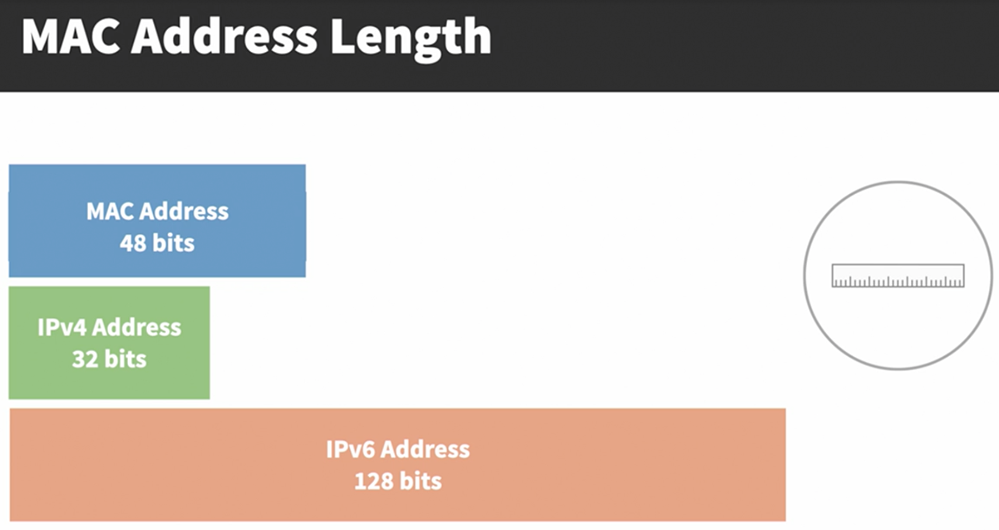
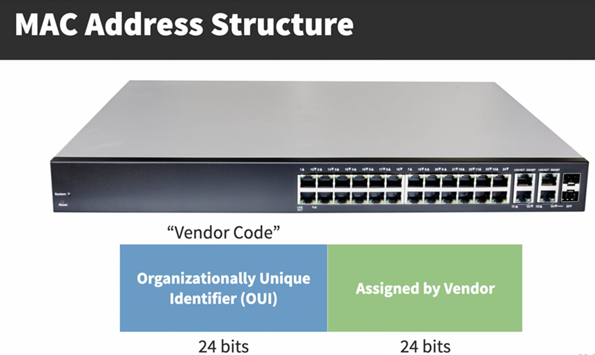
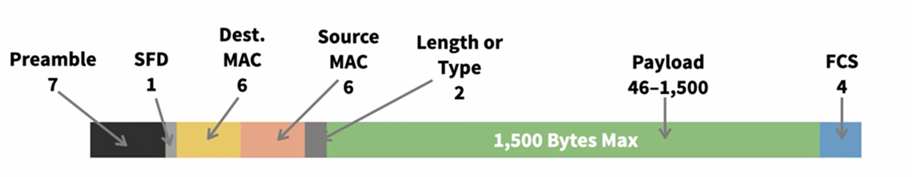
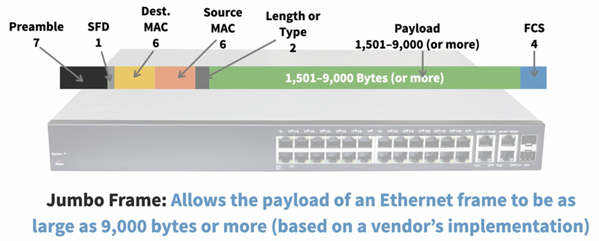
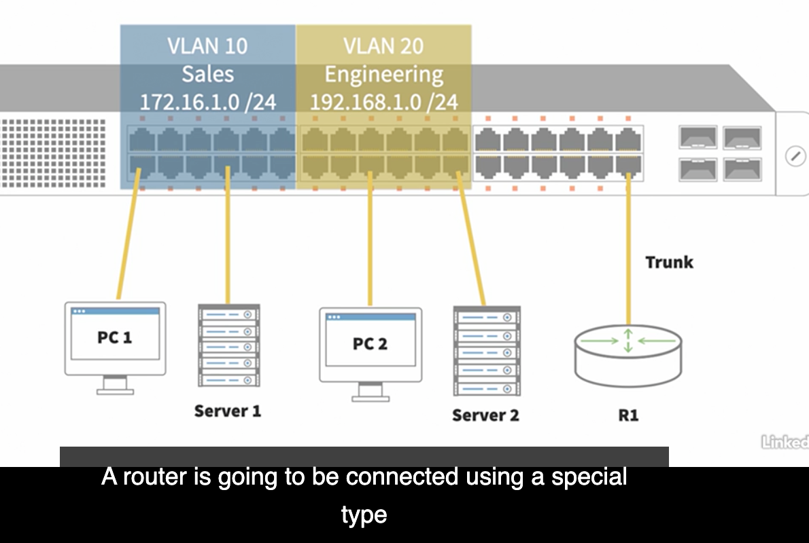

MAC Address Length

### Ethernet Frame Format

**Preamble**

**SFD** Start Frame Delimiter: signals the end of the preamble

**Dest. MAC**

**Source MAC**

**Length or Type**: 

* size of the payload (if the value is 1500 or less)
* the type of network layer protocol encapsulated (if the value is 1536 or higher)

**Payload**: The Layer 3 Packet containing data to be transmitted （46 - 1,500）

**FCS** Frame Check Sequence: Mathematically determines if the frame was corrupted in transit 

An Enternet header adds 18 bytes (Dest. MAC + Src. MAC + LengthORType + FCS)

### VLAN Theory

Virtual LAN

An area of a network throughout which a broadcast will propagate

### STP

Spanning Tree Protocol

Allows a Layer 2 network to have redundant physical connections while preventing traffic from looping through those redundant connections

STP allows a physically redundant topology tobe logically loop-free

