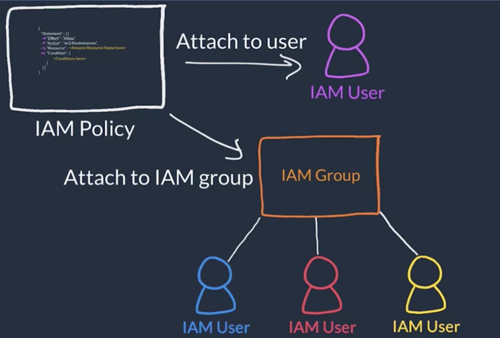

| term              | suo  |
| ----------------- | ---- |
| Availability Zone | AZ   |
|                   |      |

Resources:

- [*External Site:* AWS: Global Infrastructure](https://aws.amazon.com/about-aws/global-infrastructure/)
- [*External Site:* AWS:  AWS Global Infrastructure (dynamic site)](https://infrastructure.aws/)
- [*External Site:* AWS: AWS Global Infrastructure  Documentation](https://docs.aws.amazon.com/whitepapers/latest/aws-overview/global-infrastructure.html)
- [*External Site:* AWS: AWS Regions and  Availability Zones](https://aws.amazon.com/about-aws/global-infrastructure/regions_az/)
- [*External Site:* AWS: AWS service endpoints](https://docs.aws.amazon.com/general/latest/gr/rande.html)
- [*External Site:* AWS: AWS Regional Services](https://aws.amazon.com/about-aws/global-infrastructure/regional-product-services/)

Authentication

Authentication ensures that the user is who they say they are.

Authorization

Authorization is the process of giving users permission to access AWS resources and services.

