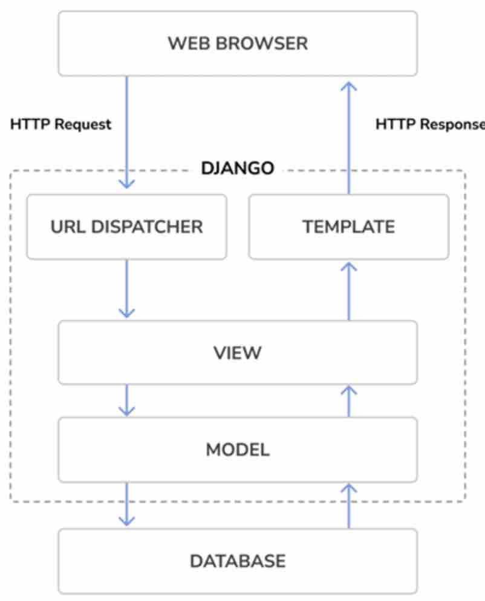

1. A web browser requests a page by its URL and the web server passes the HTTP request to Django 
2. Django runs through its configured URL patterns and stops at the first one that matches the requested URL.
3. Django executes the **view** that corresponds to the matched URL pattern.
4. The view potentially uses data **models** to retrieve information from the database.
5. Data **models** provide the data definition and behaviors. They are used to query the database.
6. The view renders a template (usually HTML) to display the data and returns it with an HTTP response.

