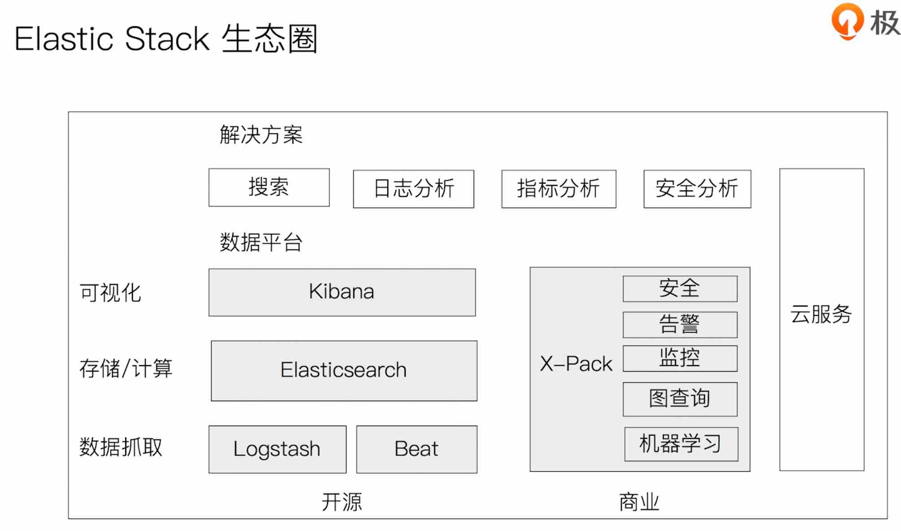
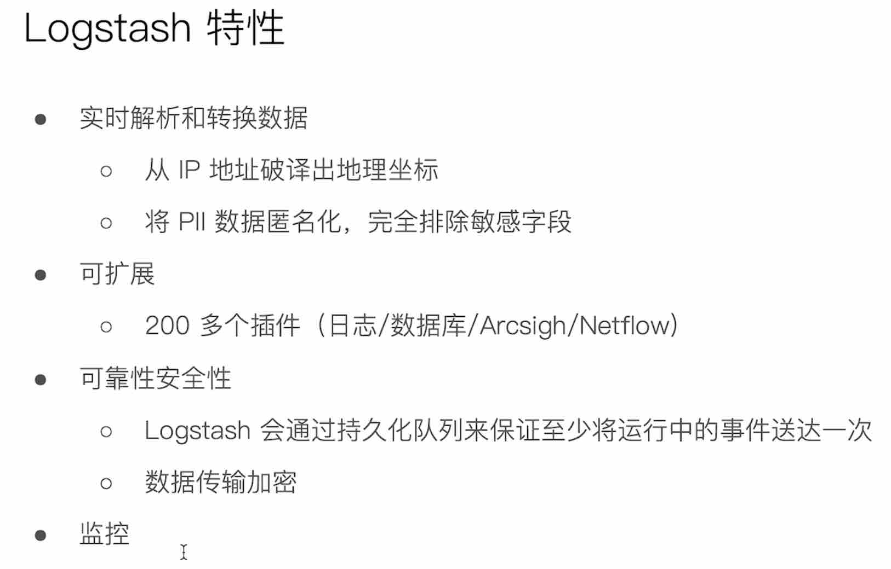
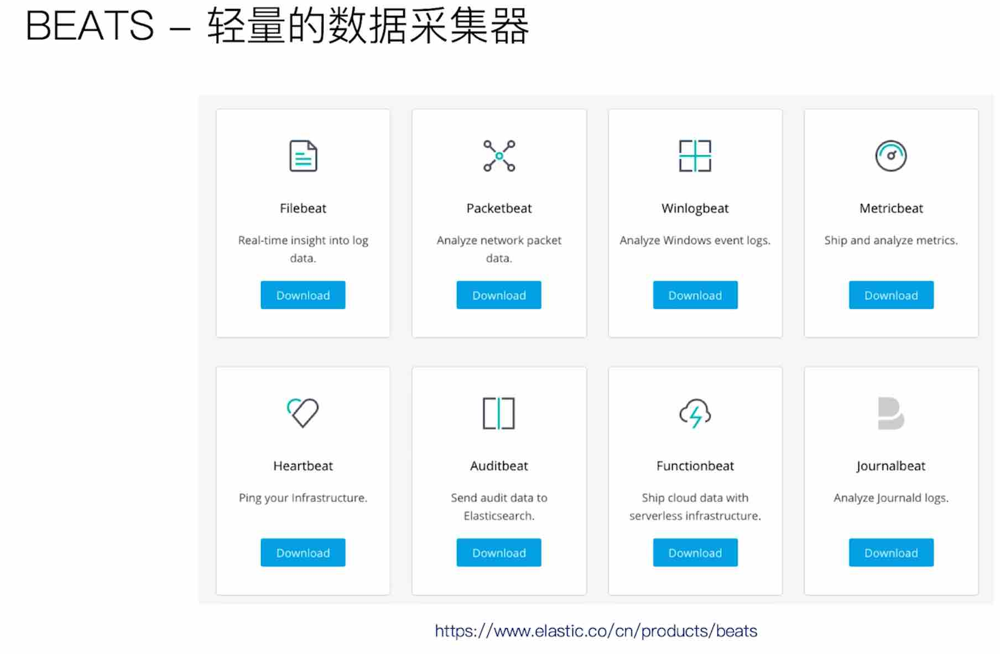
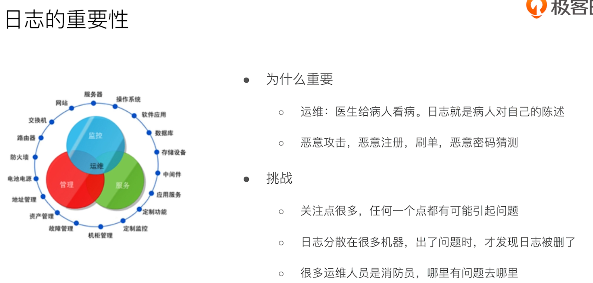
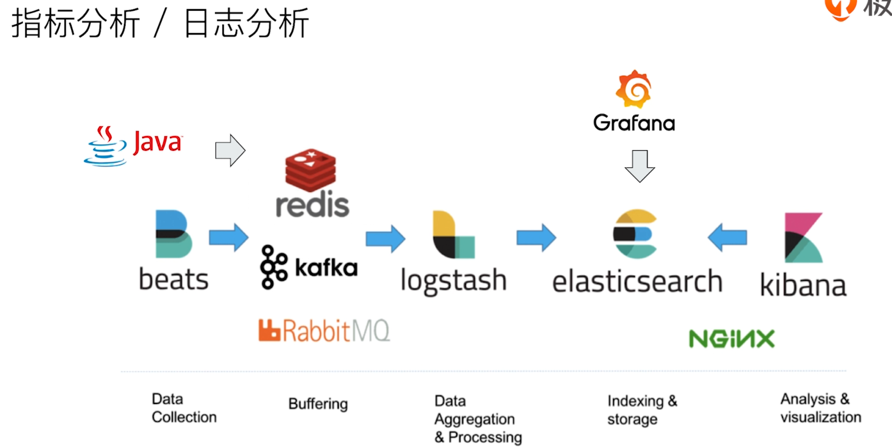

logstash




beats 轻量的数据采集器




日志




指标分析/日志分析





```
-> Elasticsearch security features have been automatically configured!
-> Authentication is enabled and cluster connections are encrypted.

->  Password for the elastic user (reset with `bin/elasticsearch-reset-password -u elastic`):
  8sEO4qArmFq7BOdaEu1L

->  HTTP CA certificate SHA-256 fingerprint:
  76f23b3995b7da2e42892be078cd66797b995cb1b2f165f2595c32d29d0e62db

->  Configure Kibana to use this cluster:
* Run Kibana and click the configuration link in the terminal when Kibana starts.
* Copy the following enrollment token and paste it into Kibana in your browser (valid for the next 30 minutes):
  eyJ2ZXIiOiI4LjQuMSIsImFkciI6WyIxNzIuMTkuMC4yOjkyMDAiXSwiZmdyIjoiNzZmMjNiMzk5NWI3ZGEyZTQyODkyYmUwNzhjZDY2Nzk3Yjk5NWNiMWIyZjE2NWYyNTk1YzMyZDI5ZDBlNjJkYiIsImtleSI6IjNKUjRDNE1Cc3RNOEZFS2ZZanNrOlRmTTlTUXdxU3gyTTFsakxUWkUwRkEifQ==

-> Configure other nodes to join this cluster:
* Copy the following enrollment token and start new Elasticsearch nodes with `bin/elasticsearch --enrollment-token <token>` (valid for the next 30 minutes):
  eyJ2ZXIiOiI4LjQuMSIsImFkciI6WyIxNzIuMTkuMC4yOjkyMDAiXSwiZmdyIjoiNzZmMjNiMzk5NWI3ZGEyZTQyODkyYmUwNzhjZDY2Nzk3Yjk5NWNiMWIyZjE2NWYyNTk1YzMyZDI5ZDBlNjJkYiIsImtleSI6IjI1UjRDNE1Cc3RNOEZFS2ZZanNrOkxmdFdFNkJqUmFLd0F5UHlBNDY2UGcifQ==

  If you're running in Docker, copy the enrollment token and run:
  `docker run -e "ENROLLMENT_TOKEN=<token>" docker.elastic.co/elasticsearch/elasticsearch:8.4.1`
```


