## Branch Management

### force push to a remote

Reasons

* Local version is better than the remote version
* Remote version went wrong and needs repair
* Versins have diverged and merging is undesirable

Impacts

* use with extreme caution
* easy way to anger your whole development team
* Disruptive for others using the remote branch
* Commits disappear
* Subsequent commits are orphaned


❗️最好别用


collaborator shoud do this, after someone force push

```sh
$ git reset --hard origin/master
```


### Identify merged branches


* List branches that have been merged into a branch
* Useful for knowing what features have been incorporated
* Useful for cleanup after merging many features

```sh
git branch --merged

git branch --no-merged # not yet merged

git branch -r --merged # remote
```


### delete local and remote branch

```sh
git branch -d new_feature

# Delete not yet merged branch
git branch -D new_feature

# Delete remote branch
git push origin :new_feature
# git push origin <local>:<remote>

# delete remote branch, v1.7.0+
git push --delete origin new_feature

# delete remote branch, v2.8.0
git push -d origin new feature
```


### Prune stale branches

#### remote branches

1. Branch on the remote repository (bugfix)
2. Local snapshot of the remote branch (origin/bugfix)
3. Local branch, tracking the remote branck (bugfix)

 Now if we delete a remote, it's also going to prune the **remote-tracking** branch automatically at the same time

1 & 2 delete together

* necessary when collaborators delete branches
* Fetch doesn't automatically prune

```sh
# delete stale remote-tracking branches
git remote prune origin
git remote prune origin --dry-run

git fetch --prune
git fetch -p

# always prune before fetch
git config --global fetch.prune true

```


## Tagging

### Create tags

```sh
# Add lightweight tag
git tag issue136 655da716e7

# Add annotated tag (most common)
git tag -a v1.1 -m "Version 1.0" dd5c494

# list tags
git tag
git tag --list
git tag -l

git tag -l "v2*"

# list tags with annotations
git tag -l -n

# work with tags
git show v1.1

git diff v1.0..v1.1


# delete tag
git tag --delete v1.1
git tag -d v1.1


```


### Pus tags to a remote


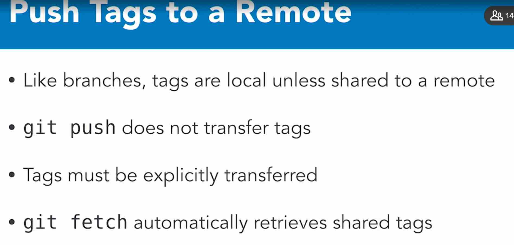


```sh

# push a tag to a remote server
$ git push origin v1.1
# push
$ git push origin --tags

# fetch commits and tags
$ git fetch

# fetch only tags with necessary commits
git fetch --tags

# delete remote tags like remote branches
$ git push origin :v1.1
$ git push --delete origin v1.1
$ git push -d origin v1.1

```


### Check out tags


#### Detached HEAD State

* Cheking out a commit puts the local repository in a "detacted HEAD state"
* like being on an **unnamed branch**
* new commits will not belong to any branch
* detached commits will be garbage collected (~2 weeks)

直接check在tag上会进入detached HEAD state，相当于再commit的话会进入到没名字的分支（就叫分支a吧）。当checkout回到master，想再回到分支a时，就回不来了。

也有办法可以补救

```sh
# Tag the commit (HEAD detached)
git tag temp

# Create a branch (HEAD detached)
git branch temp_branch

# create a branch and reattach HEAD
$ git checkout -b temp_branch


```


## Interactive Staging

stage changes interactively

Allows staging portions of changed files

Helps to make smaller, focused commits

Feature of many Git GUI tools

```sh
git add --interactive
git add -i

```

### Patch Mode

* allow staging portions of a changed file
* "Hunk": an area where two files differ
* Hunks can be staged, skipped, or split into smaller hunks

### Split  a Hunk

* Hunks can contain multiple changes
* Tell Git to try to split a hunk further
* Requires one or more unchanged lines between changes


## Share Select Changes


### Cherry-picking commits

* Apply the changes from one or more existing commits
* Each existing commit is recorded as a new commit on the current branch
* Conceptually similar to copy-paste
* New commits have different SHAs


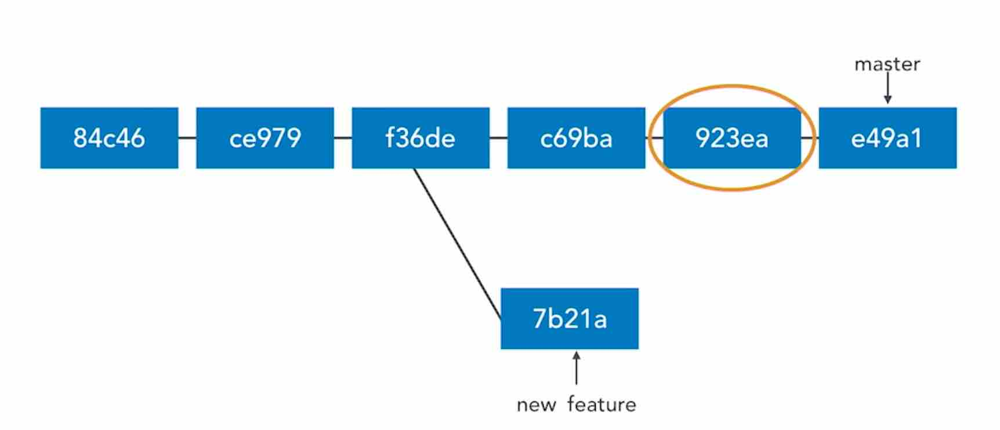


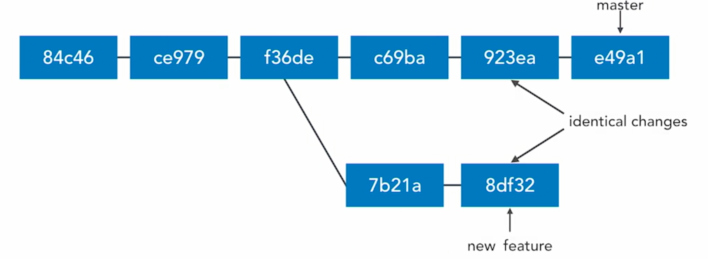


cannot cherry pick a merge commit


### create diff patches

* share changes via files
* useful when changes are not ready for a public branch
* useful when collaborators do not share a remote
* discussion, review, approval procss


```sh
$ git diff sha1 sha2 > for_review.diff
```


### create formatted patches

export each commit in Unix mailbox format

includes commit message

one commit per file

```sh
# export all commits in the range
git format-patch sha1..sha2

# Export all commits on current branch
# which are not in master branch
git format-patch master

# Export a single commit
git format-patch -l sha1

# Put patch files into a directory
git format-patch master -o feature

# Output patches as a single file
git format-patch sha1..sha2 --stdout > feature.patch
```

### apply formatted patches

```sh
# apply single patch
git am feature/sss.patch

```


## Rebasing

### Rebase commits

* take commits from a branch and replay them at the end of another branch
* useful to integrate recent commits without merging
* maintains a cleaner, more linear project history
* ensures topic branch commits apply cleanly


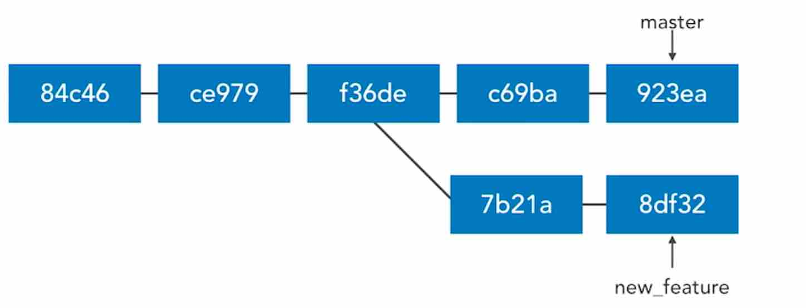

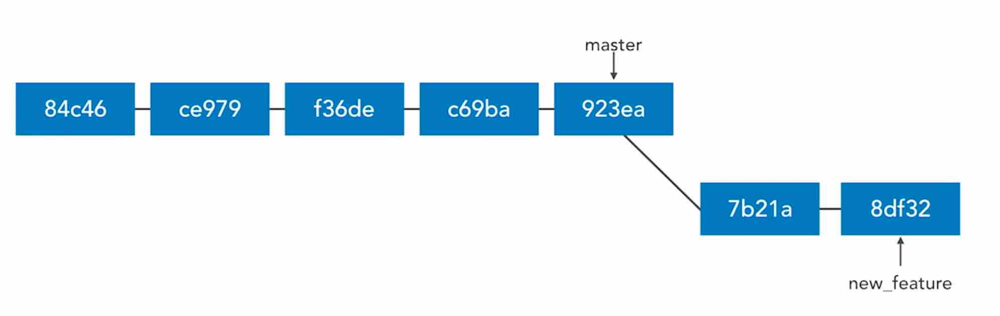

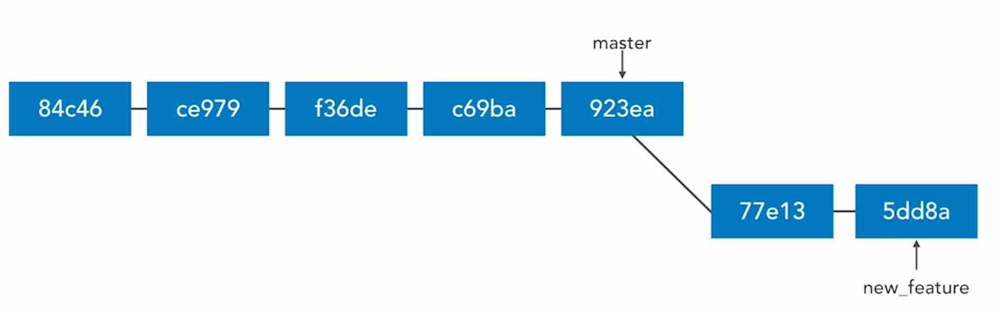

```sh
# rebase current branch to tip of master
git rebase master

# rebase new_feature to tip of master
git rebase master new_feature

# useful for visualizing branches
git log --graph --all --decorate --oneline

# return commit where topic branch diverges
git merge-base master new_feature

```


### merging vs. rebasing

* 2 ways to incorporate changes from one branch into another branch
* similar ends, but the means are different


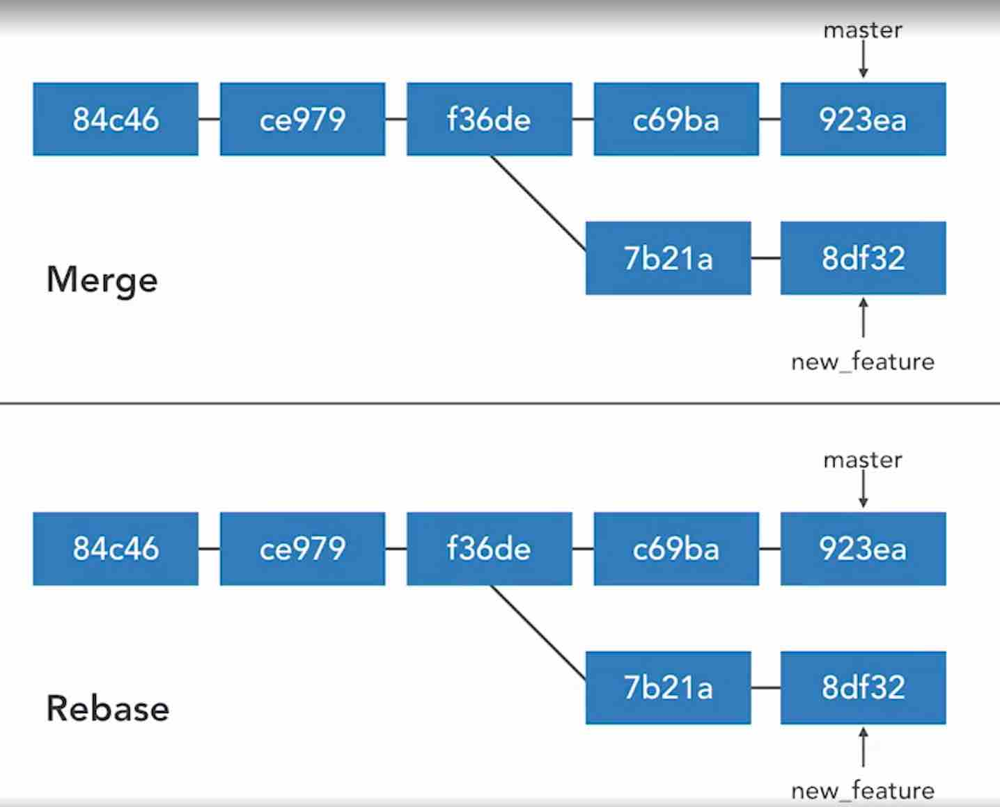


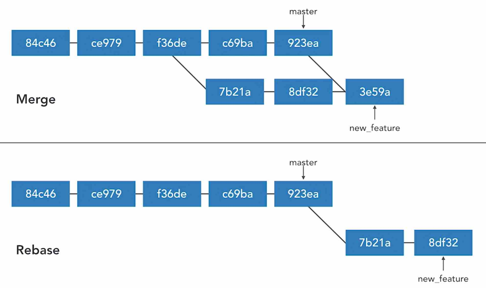


#### merge

* adds a merge commit
* nondestructive
* complete record of what happened and when
* easy to undo
* logs can become clutterd, non-linear


#### rebasing

* no additional merge commit
* destructive: SHA changes, commits are rewritten

* no longer a complete record of what happened and when 
* tricky to undo


#### how to choose

* **merge** to allow commits to stand out or to be clearly grouped

* **merge** to bring large topic branches back into master

* **rebase** to add minor commits in master to a topic branch

* **rebase** to move commits from one branch to another

  

:exclamation: Merge anytime the topic branch is already public and being used by others]


### resolve rebase conflicts

```sh
git rebase --continue

git rebase --skip

git rebase --abort


```


#### rebase onto other branches

```sh
git rebase --onto newbase upstream branch
git rebase --onto master ecommerce new_feature
```

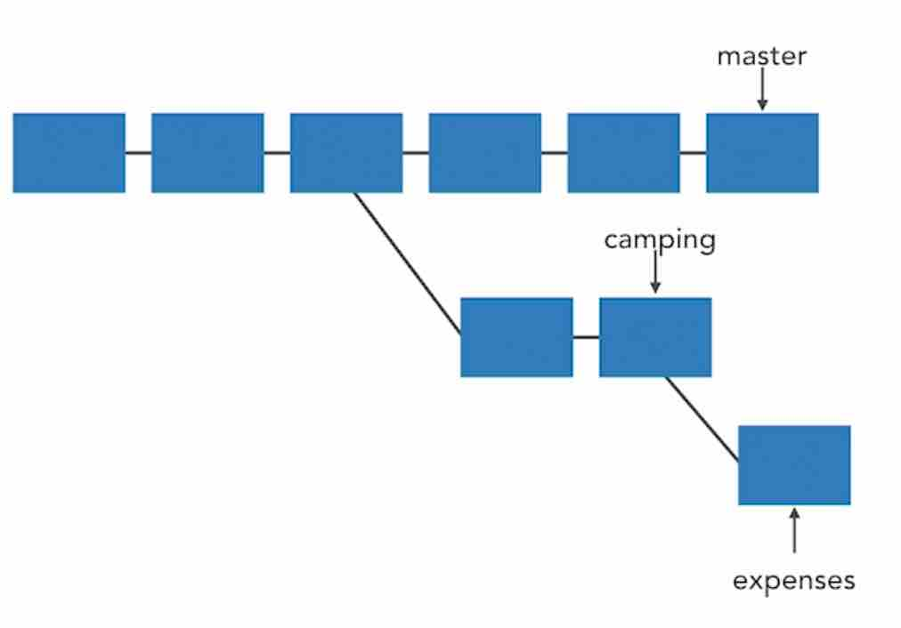


```sh
$ git rebase --onto master camping expenses
```


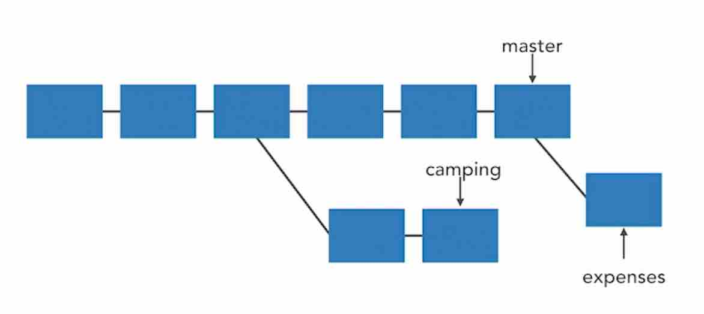

#### undo a rebase

* can undo simple rebases
* rebase is destructive
* SHAs, commit messages, change sets, and more
* undoing complex rebases may lose data


```sh
git reset --hard ORIG_HEAD
```


#### Interactive Rebasing

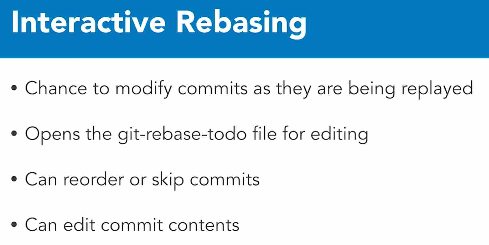


* pick drop
* reword edit
* squash, fixup
* exec

#### Squash commits

* fold two or more commits into one
* squash: combine change sets, concatenate messages
* fixup: combine change sets, discard this message
* Uses first author in the commit series

```sh
# rebase last 3 commits onto the same branch
# but with the opportunity to modify them
git rebase -i HEAD~3

```

#### Pull rebase

```sh
git pull
# equal 
git fetch
git rebase
```

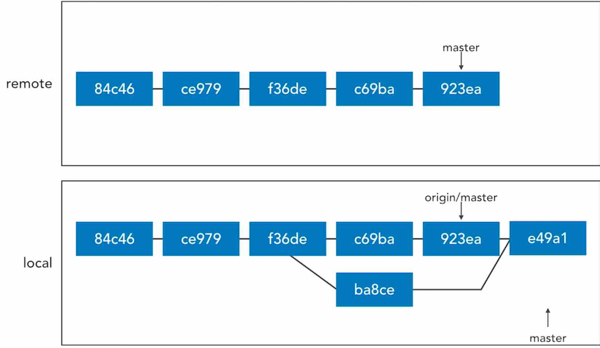


```sh
git pull --rebase
git pull -r
```

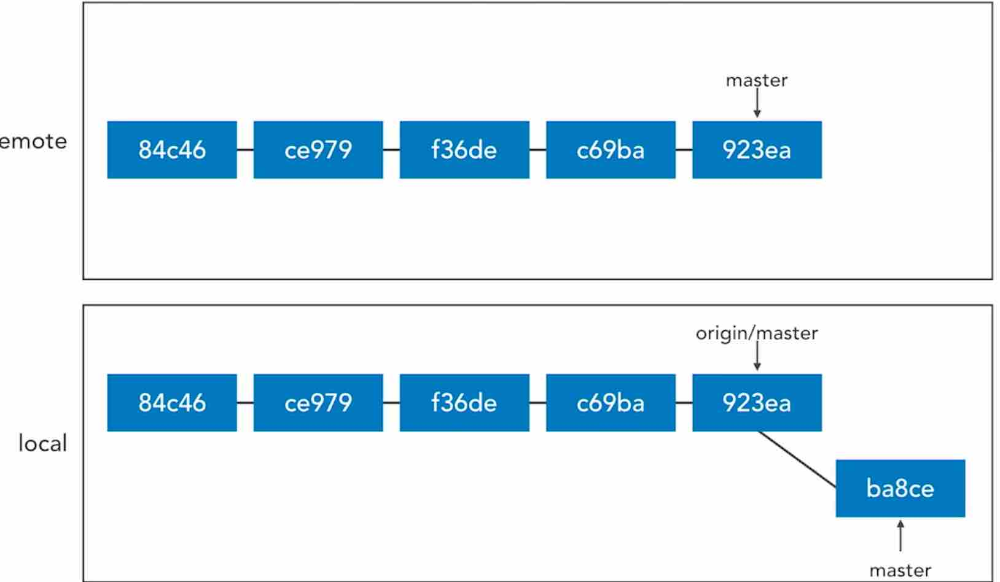


```sh

```

### Blame


```sh
# Annotate file with commit details
git blame filename.txt

# Ignore whitespace
git blame -w filename.txt

# Annotate line 100-150
git blame -L 100,150 filename.txt

# Annotate lines 100-105
git blame -L 100,+5 filename.txt
```


### Bisect

* Find the commit that introduced a bug or regression
* Mark last good revision and first bad revision
* reset code to mid-point


```sh

```

