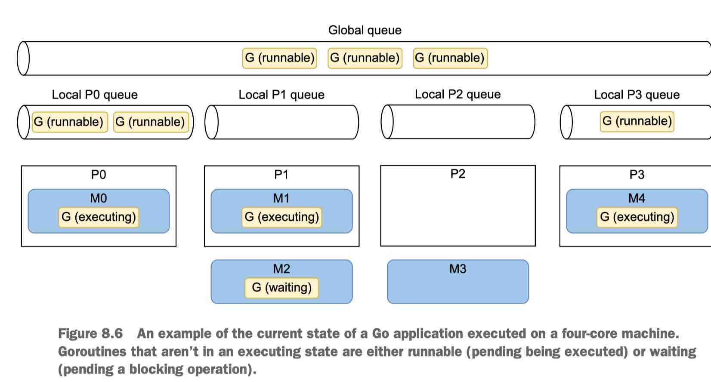

## Ch 8 Concurrency: Foundations


### 8.1 #55 concurrency vs parallelism

Unlike parallelism, which is about doing the same thing multiple times at once, concurrency is about structure.

并发与并行不同，并行是指同时多次做同一件事，而并发是关于结构。


Concurrency is about dealing with lots of things at once. Parallelism is about doing lots of things at once.

Concurrency is about dealing with things happening out-of-order

Parallelism is about things actually happening at the same time.


From "Concurrency in Go", cocurrency is a property of the code; paralleism is a property of the running program.

We do not write ==parallel== code, only ==concurrent== code that we hope will be run in parallel.

我们不写并行（parallel）代码，只写并发（concurrency）代码，并希望代码能并行地(in parallel) 运行

Parallelism is a property of the **runtime** of our program.


### 8.2 #56 Thinking concurrency is always faster

The overall performance of a solution depends on many factors, such as 

* the efficiency of our structure (concurrency), 
* which parts can be tackled in parallel, 
* and the level of contention among the computation units.


OS级线程是由操作系统在CPU核上进行上下文切换的，

goroutine是由Go Runtime在操作系统线程上进行上下文切换的。


If we’re not sure that a parallel version will be faster, the right approach may be to start with a simple sequential version and build from there using profiling and benchmarks.

如果我们不确定并行版本是否会更快，正确的方法可能是先从简单的顺序版本开始，然后使用剖析和基准测试来建立。



### 8.3 #57 channel vs mutex

Whenever we want to share a state or access a shared resource, mutexes ensure exclusive access to this resource. Conversely, channels are a mechanic for signaling with or without data (chan struct{} or not). Coordination or ownership transfer should be achieved via channels.

每当我们想共享一个状态或访问一个共享资源时，mutex就会确保对这个资源的独占访问。反之，channel是一种机制，用于发送有或无数据的信号（chan struct{}或无数据）。协调或所有权的转移应该通过通道来实现


### 8.4 #58 race problem

`-race`

If the effects of a goroutine must be observed by another goroutine, use a synchronization mechanism such as a **lock** or **channel** communication to establish a relative ordering.

```go
i := 0
ch := make(chan struct{})
go func() {
  <- ch
  fmt.Println(i)
}()
i++
ch <- struct{}{}
```

var inc < chan send < chan rec < var read


### 8.6 #59 workload type

CPU-bound

IO-bound

memory-bound

If the workload is **I/O-bound**, the answer mainly depends on the external system. How many concurrent accesses can the system cope with if we want to maximize throughput?

If the workload is **CPU-bound**, a best practice is to rely on GOMAXPROCS.


### 8.7 #60: Misunderstanding Go contexts

A Context carries a deadline, a cancellation signal, and other values across API boundaries


`context.Context` exports an `Err` method that returns `nil` if the `Done` channel isn't yet closed.

It returns a non-nil error explaining why the `Done` channel was closed

综上所述，要成为一名熟练的Go开发者，我们必须了解什么是**context**以及如何使用它。在Go中，`context.Context`在标准库和外部库中无处不在。正如我们所提到的，一个context允许我们携带一个最后期限、一个取消信号和/或一个键值列表。一般来说，用户等待的函数应该带一个上下文，因为这样做可以让上游的调用者决定什么时候应该中止调用这个函数。


