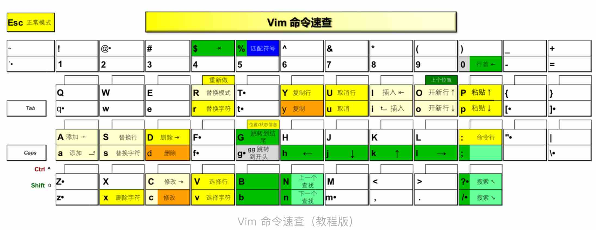

轻量级 Vim 配置框架，全中文注释

https://github.com/skywind3000/vim-init


| Command | Description                    |
| ------- | ------------------------------ |
| `(`     | 移动到上一句                   |
| )       | 移动到下一句                   |
| {       | 移动到上一段                   |
| }       | 移动到下一段                   |
| gg      | 跳转到文件开头                 |
| G       | 跳转到文件最后一行的第一个字符 |


split Vim Screen Vertically 竖着切

```
<c-w> v
```

navigate 

```sh
<c-w> j # down
<c-w> k # up
<c-w> h # left
<c-w> l # right
```

Splitting Vim Screen Horizontally 横着切

```sh
<c-w> s
```


```sh

```


```sh

```


## Resources

[Setting up Vim for YAML editing](https://www.arthurkoziel.com/setting-up-vim-for-yaml/)

[Vim Plugins](https://hackingcpp.com/dev/vim_plugins.html)

[missing semester | Editors (Vim)](https://missing.csail.mit.edu/2020/editors/)

vim 新手框架

https://github.com/skywind3000/vim-init


[vim-go tutorial](https://github.com/fatih/vim-go/wiki/Tutorial)
